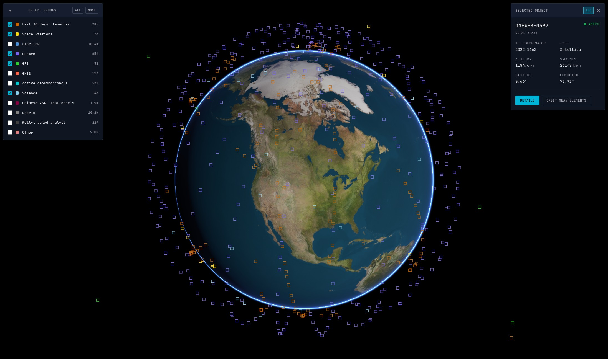

# Orbis

> [!WARNING]
> This project is a work in progress and not ready for general use.

A space object tracking and visualisation application. Renders satellite (e.g. ISS, Starlink, GPS, debris) based on data from [CelesTrak](https://celestrak.org).

## Project Structure

- `game/` - Main application (space object logic, rendering, components, systems)
- `pandora/` - [C++20 game engine framework](https://codeberg.org/pedronunes/pandora/) (WebGPU, ECS, physics, resources)
- `webapp/` - SvelteKit frontend for web deployment

## License

*Orbis* is licensed under the GPLv3 License, see [LICENSE](LICENSE) for more information.
